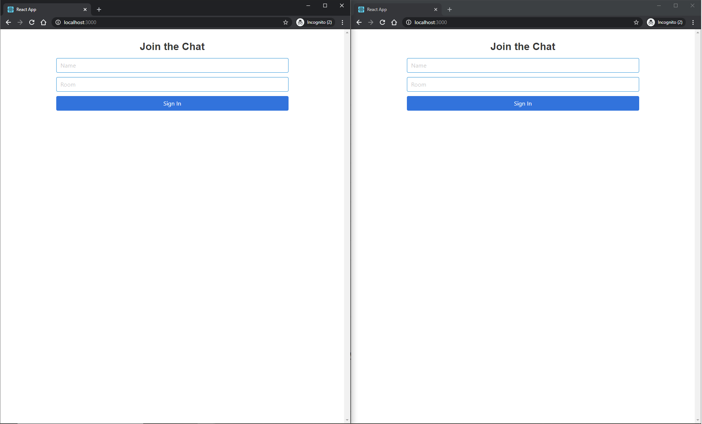
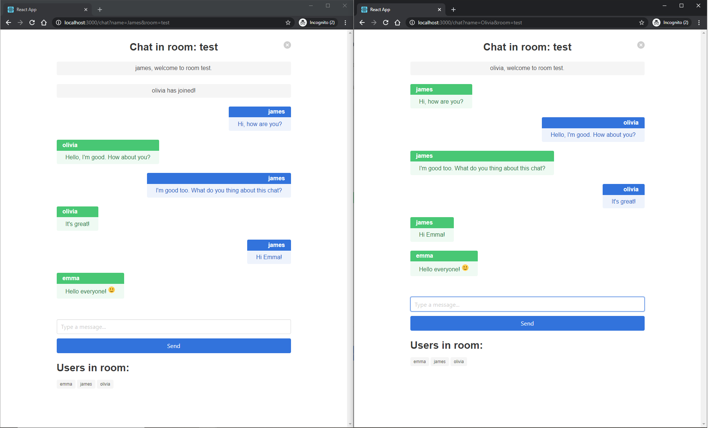

# chat-react

Create chat application using React and Socket.IO.

## Table of contents

- [General info](#general-info)
- [Technologies](#technologies)
- [Features](#features)
- [Screenshots](#screenshots)
- [Setup](#setup)
- [Status](#status)
- [License](#license)

## General info

Goal of project is to create simple chat application using React.

## Technologies

- [React](https://reactjs.org/)
- [Socket.io](https://socket.io/)
- [Bulma](https://bulma.io)
- Css modules
- Sass
- [Eslint](https://eslint.org/)
- [Prettier](https://prettier.io/)

## Features

- Join chat
- Chat with friends
- Emoticons support

## Screenshots

## Setup

How to run this project.

1. Clone this repo

2. To run, go to project folder and run

`$ npm install`

3. Now start dev server by running -

`$ npm start`

4. visit - http://localhost:3000/

To create production ready codes -

`$ npm run build`

for more commands refer `package.json`

## Status

Project is finished.

## License

MIT
